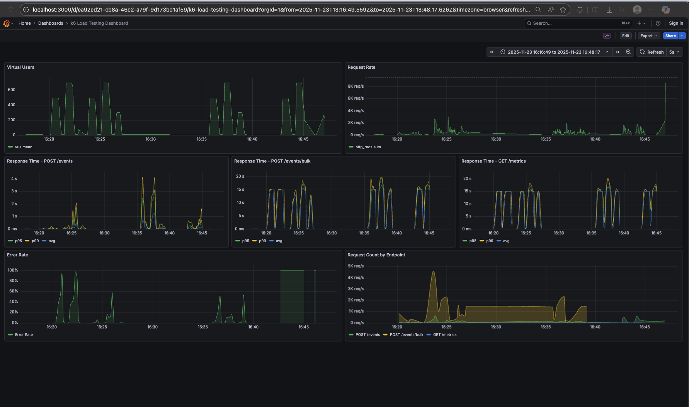
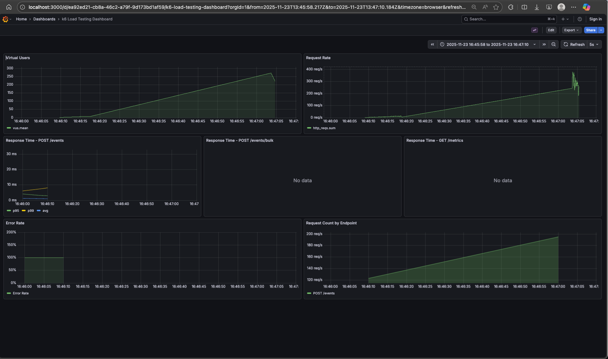

# ClickHouse Event Tracking API

A high-performance event tracking and analytics service built with Go, ClickHouse, and Redis. This service provides real-time event ingestion with deduplication and aggregated metrics querying capabilities.
Blah blah

## Features

- **Deduplication**: Use bloom-filter like check with redis, guarantee deduplication on the DB layer
- **API Documentation**: Interactive Swagger UI for API exploration. both root (`/`) and `/swagger` endpoints redirect to swagger UI.
- **Load Test Setup**: There is a load test setup directory [loadtests](loadtests).
- **Docker Compose**: There is docker compose provided for local development that includes DB, redis and the monitorin tools for the load tests.

- There are a bunch of makefile commands for convenience

## Libraries Frameworks
Fiber for convenience and speed (even though I have some reservations about the infamous benchmark).  
Same rational for the redis client as well.

I used uptracer's clickhouse library with ORM. It outperforms clickhouse's own ORM library. 
Ideally, one could use the low level libraries like ClickHouse/ch-go (Go). Obviously it depend on the use case.
As the joke goes, a startup that has less users than they have microservices probably don't need it.
 See more details https://github.com/ClickHouse/ch-bench


## Clickhouse vs PostgreSQL
Clickhouse is an OLAP, while PostgreSQL an OLTP.
As it is known (argumentum ad populum) for the analytical loads (event processing etc.) OLAP DBs outperforms the OLTPs. (Yeah, A in OLAP standing for analytics make it easier to claim)

In analytical use cases, data in the same column (accross rows) is more frequently used than non-analytical use cases. Because OLAP stores data in column oriented way (if I may say), unlike the OLTP that stores in row oriented ways. (compare parquet vs. csv)

E.g. computing average count per event_name in a time interval can be computed with just event_name columns.
So in this case we can just read a single column, instead of reading all rows with irrelevant data in them.
This use case is partially covered with indices but there is a limits to how many indices one can use as there is an increasing overhead penalty on Write operations.

Since the data of the same column are stored next to each other one can take advantage of SIMD when aggreagting over columns. Clickhouse does this. BTW, I am happy that finally I can use keywords like SIMD, vectorization etc. My night on [https://www.cs.bilkent.edu.tr/~ozturk/cs426/](cs426 projects) are not wasted.

Clickhouse uses various [MergeTree engines](https://clickhouse.com/docs/engines/table-engines/mergetree-family/mergetree). They're a way to write data to disk in sequential (append only). Similar to the that of how Kafka stores the messages. Unlike the kafka, there are much more partitions created on the fly and they're merged in the background.  
I used ReplacingMergeTree so that I can guarantee no event is processed twice.
> **Warning** I've been bit by how it handles duplicate records. Unlike the OLTP DBs it doesn't reject on same unique key, it accepts them and *eventually* deletes one of them. So, when querying the data, one needs to use [FINAL](https://clickhouse.com/docs/engines/table-engines/mergetree-family/replacingmergetree#query-time-de-duplication--final) keyword after table name to force the deduplication.  

There is one additional benefit of Clickhouse over PostgreSQL, you can start saying I use Clichouse BTW and look down to other people :lol:.

I considered using the VictoriaMetrics as they have solid [engineering blog](https://victoriametrics.com/blog/) especially on [Go](https://victoriametrics.com/blog/categories/go-@-victoriametrics/page/3/).
I assume they know better than me, and their product is comparable or better than Clickhouse depending on use cases.
However I didn't give it fair chance since Clickhouse seemed safer option given the scope. 

## Quick Start

### Using Docker Compose (Recommended)

1. **Clone the repository**
   ```bash
   git clone <repository-url>
   cd clickhouse
   ```

2. **Start all services**
   ```bash
   make up
   # or
   docker compose up -d
   ```

3. **Access the services**
   - API: http://localhost:50051
   - Swagger UI: http://localhost:50051/swagger/index.html
   - ClickHouse Built-in UI: http://localhost:8123 username: `app`, password: `clickhouse_app_password`
   - Redis Commander: http://localhost:8081

### Local Development

1. **Install dependencies**
   ```bash
   cd src
   go mod download
   ```

2. **Install Swagger CLI**
   ```bash
   go install github.com/swaggo/swag/cmd/swag@latest
   ```

3. **Generate Swagger documentation**
   ```bash
   make swagger
   # or
   cd src && swag init -g main.go --output ./docs
   ```

4. **Run the application**
   ```bash
   make build
   ./tmp/main
   ```

## API Documentation

### Swagger UI

Interactive API documentation is available at:
```
http://localhost:50051/swagger/index.html
```

### Available Endpoints

| Method | Endpoint | Description |
|--------|----------|-------------|
| GET | `/` | Root endpoint (Hello world) |
| GET | `/health` | Health check for all services |
| POST | `/events` | Submit event data for tracking |
| POST | `/events/bulk` | Submit multiple events in bulk for high-throughput ingestion |
| GET | `/metrics` | Query aggregated metrics |
| GET | `/swagger/*` | Swagger UI documentation |

### Example: Post Event

```bash
curl -X POST http://localhost:50051/events \
  -H "Content-Type: application/json" \
  -d '{
    "event_name": "purchase",
    "channel": "web",
    "campaign_id": "summer_sale_2025",
    "user_id": "user123",
    "timestamp": 1732233600,
    "tags": ["mobile", "premium"],
    "metadata": {
      "amount": 99.99,
      "currency": "USD"
    }
  }'
```

### Example: Post Bulk Events

```bash
curl -X POST http://localhost:50051/events/bulk \
  -H "Content-Type: application/json" \
  -d '{
    "events": [
      {
        "event_name": "purchase",
        "channel": "web",
        "campaign_id": "summer_sale_2025",
        "user_id": "user123",
        "timestamp": 1732233600,
        "tags": ["mobile", "premium"],
        "metadata": {
          "amount": 99.99,
          "currency": "USD"
        }
      },
      {
        "event_name": "view",
        "channel": "mobile",
        "campaign_id": "summer_sale_2025",
        "user_id": "user456",
        "timestamp": 1732233601,
        "tags": ["electronics"],
        "metadata": {
          "product_id": "prod-123"
        }
      }
    ]
  }'
```

### Example: Query Metrics

```bash
curl -X GET "http://localhost:50051/metrics?event_name=purchase&from=1732147200&to=1732233600&group_by=channel"
```

## Makefile Commands

| Command | Description |
|---------|-------------|
| `make help` | Show all available commands |
| `make swagger` | Generate Swagger documentation locally |
| `make build` | Build the Go application |
| `make up` | Start all Docker containers |
| `make down` | Stop all Docker containers |
| `make rebuild` | Rebuild and restart containers (no cache) |
| `make logs` | View logs from all containers |
| `make logs-app` | View logs from the application container only |
| `make clean` | Clean up generated files and Docker resources |
| `make test` | Run tests |

## Development Workflow

1. **Make code changes** to Go files
2. **Update Swagger annotations** if API contracts change
3. **Regenerate docs** (optional for local inspection):
   ```bash
   make swagger
   ```
4. **Rebuild and deploy**:
   ```bash
   make rebuild
   ```
   
   The Dockerfile automatically generates Swagger docs during the build process.

## Idempotency/Deduplication

Events are deduplicated based on the combination of:
- `event_name`
- `user_id`
- `timestamp`
- `channel`

Events with identical values for these fields are considered duplicates and will be handled idempotently.

When an event is received, the service checks Redis to see if an event with the same deduplication key has already been processed. If is skipped and we return a 200 OK response.

## Consistency Model (spoiler: none)
I started with sync post event endpoint and sync DB writes. Strong consistency, EZPZ.  
But it barely worked with smoke test.  


Then I switched to Clickhouse's [async insert](https://clickhouse.com/docs/optimize/asynchronous-inserts) feature,
assuming it would be eventually consistent. It turned (i.e. I read the rest of the doc) out that async inserts are kept in clickhouse server memory. So it is not durable. On server crash/restart data would be lost.
They probably have some graceful shutdown mechanism but not all shutdown are graceful. Sometimes computers literally explode. Tough luck out there, right?

Performance wise it was better but still not good enough for the load tests.

Since I lost consistency guarantees anyway, why not give up?  
So I started using a buffered channel in the application to batch inserts. Uncool name is "fire-and-forget" mode.

A way to fix durability is to use a local file-based queue or sqlite/boltdb. So the endpoint would write to disk and sync the writes to clickhouse in the background. this would guarantee no data loss on crashes.  
We can mention the https://sqlite.org/fasterthanfs.html article to claim that sqlite is faster file writes etc. (yeah, the article is about the small blobs which are so much larger than our event records but still...)

Other alternatives are using Kafka/RabbitMQ etc. but I am not sure whether they would make a significant difference.
Yet another alternative could be using Redis for queuing. It should be quite fast - except that Redis itself is not durable unless you configure [AOF persistence](https://redis.io/docs/latest/operate/oss_and_stack/management/persistence/#aof-advantages).

## Columnar Insertion
I have provided a bulk event ingestion endpoint at `/events/bulk`.
When I wrote it I used the columnar insertion to improve performance.
At the time the post event endpoint did not have application level batching.
During the refactor I used the same columnar insertion method for single events as well.
So that is another +.

## Load Test Setup
As usual I had Cursor/Co-Pilot prepare me a load testing setup with k6.
It even integrated with Grafana (over influxDB) and prepared a neat dashboard (I had to debug some silly mistakes but was worth the ROI)

<!-- See image at  -->
<!-- Embed the image instead -->

ps. Never ask a developer (me) why there is sudden drop in request rate after increasing to 8k RPS.




## Environment Variables

| Variable | Description | Default |
|----------|-------------|---------|
| `PORT` | Application port | `50051` |
| `CLICKHOUSE_HOST` | ClickHouse hostname | `clickhouse` |
| `CLICKHOUSE_PORT` | ClickHouse port | `9000` |
| `CLICKHOUSE_DATABASE` | ClickHouse database | `default` |
| `CLICKHOUSE_USER` | ClickHouse username | `default` |
| `CLICKHOUSE_PASSWORD` | ClickHouse password | `` |
| `REDIS_HOST` | Redis hostname | `redis` |
| `REDIS_PORT` | Redis port | `6379` |
| `REDIS_ENDPOINT` | Redis endpoint | `redis:6379` |
| `REDIS_PASSWORD` | Redis password | `` |
| `ENV` | Environment (production/development) | `production` |
| `LOG_LEVEL` | Logging level | `ERROR` |

## License

MIT